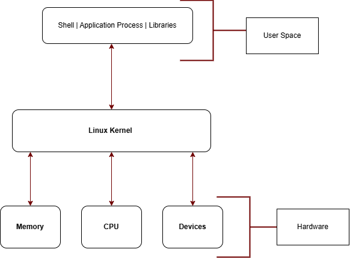

##### Weekly Learning Summary 
#### **Week Number:** Week 2  

#### **Week Topics**

- Introduction to the Linux Kernel
- Kernel Space and the User Space
- Working with Hardware

### Linux Kernel
The Kernel is the major component of an Operating system. It is like the engine of the OS.
Kernel is the core interface between a computer hardware and its processes. Linux has a monolithic kernel but modular in implementation. 

- Linux is monolithic means that it runs everything by itself. It is in charge of Cpu Scheduling, Memory management and several other operations by itself.

- When I said that Linux has modular capabilities, I mean that its part can be dynamically loaded and managed. For instance, you add or remove parts without rebuilding the whole machine. You plug a new USB driver in a file system and its automatically loaded and when its removed, its unloaded without reloading the system.

*Figure 1: How the Linux kernel communicates with CPU, memory, devices, and applications.*

## Kernel Task
There are four major task for the linux command

- **Memory Management**: Linux kernel keeps track of how much memoory is used to store what and where.
- **Process Management**: Determines which processes can use the CPU, when and for how long it will last.
- **Device Drivers**: Linux kernel also acts as a mediator or interpreter between the hardware devices and your application processes.
- **System Calls and Security**: It receives requests for Services from the applications processes, it runs it and returns results.Before the kernel also runs a task, it check permissions and access controls

